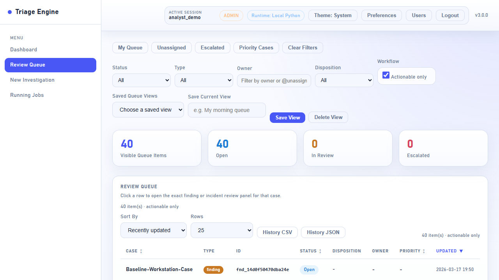
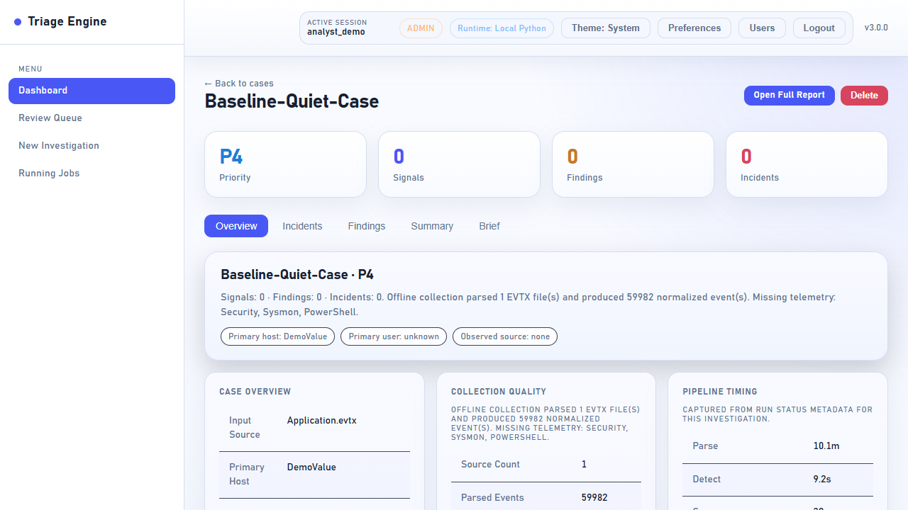
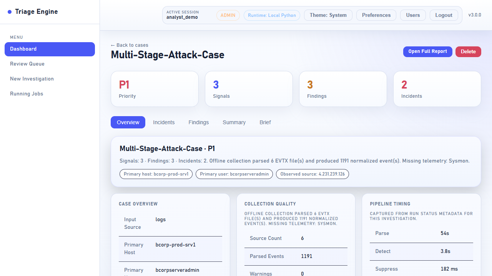
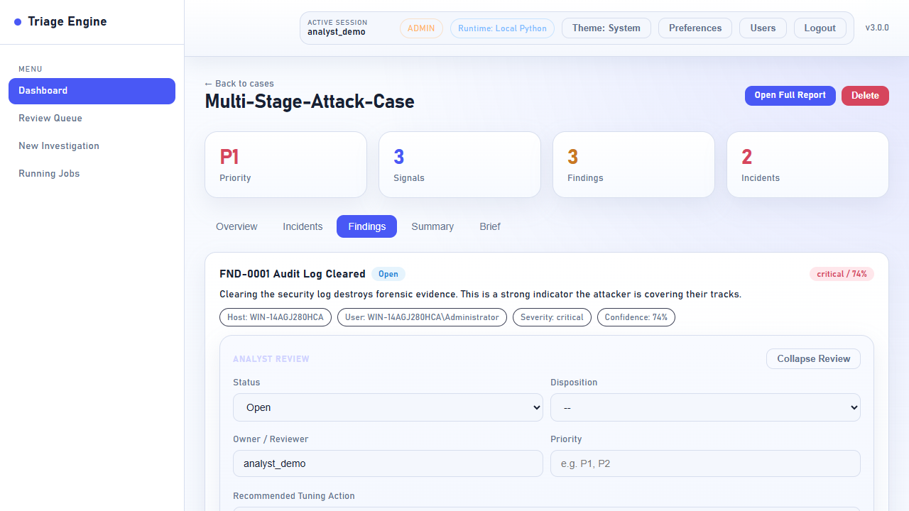
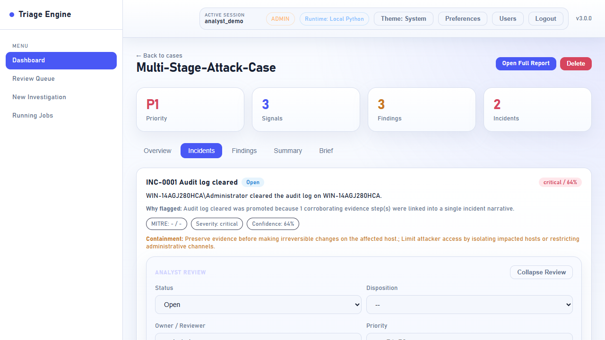
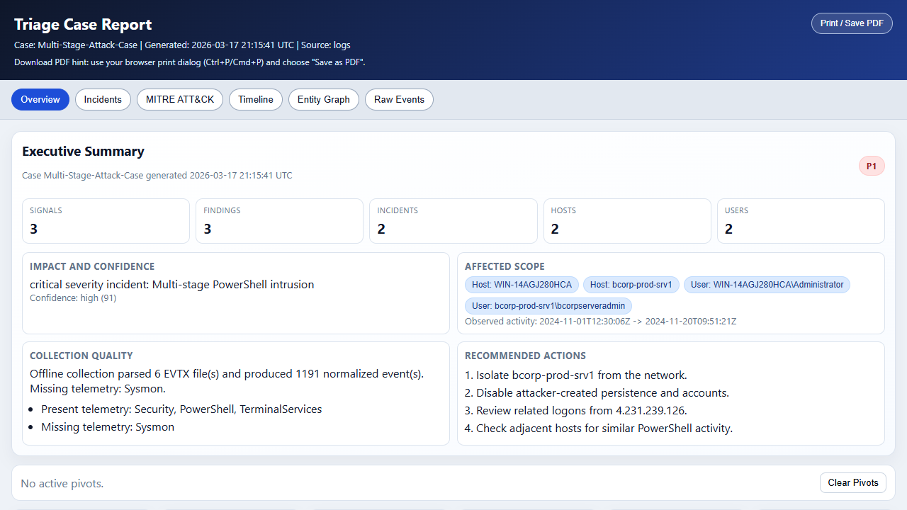

# Triage Engine

Triage Engine - Windows Endpoint Investigation Platform

Windows endpoint investigation platform for EVTX triage, detection, correlation, analyst review, and HTML case reporting.

Triage Engine was built to make Windows log investigations easier to run, easier to explain, and easier to review. Instead of stopping at raw alerts, it turns event data into cases with findings, incidents, analyst workflow, and report artifacts that are ready to hand off.

## Features

- Offline EVTX investigations with case-based outputs
- Live Windows collection mode for local endpoint triage
- Native detections plus optional Sigma rule evaluation
- Promotion from alerts to signals, findings, and incidents
- Review Queue with ownership, notes, and disposition tracking
- HTML report, summary, incident brief, timeline, and graph artifacts
- Local Python and Docker startup paths

## Screenshots

### Review Queue

Analyst queue showing promoted work items, workflow status, and assignment actions.



### Baseline Case Overview

Low-noise baseline investigation used to compare expected activity against suspicious activity.



### Attack Case Overview

Higher-signal investigation with promoted findings, incidents, scope metadata, and analyst guidance.



### Finding Detail

Finding review workflow with status, disposition, owner, notes, and evidence context.



### Incident Detail

Incident review workflow with containment guidance, severity, confidence, and escalation controls.



### HTML Report Overview

Generated case report showing the executive summary and analyst-ready reporting output.



## Demo Workflow

The default public walkthrough compares a quieter baseline case against a higher-signal attack case.

- `Baseline-Quiet-Case`
- `Multi-Stage-Attack-Case`

Recommended flow:

1. Run a clean EVTX set or a smaller clean subset as the baseline case.
2. Run an attack EVTX set that produces findings and incidents.
3. Open the Review Queue to compare noise level and promoted work items.
4. Open each case to compare counts, evidence, and analyst workflow.
5. Open the HTML report to show the reporting path from raw logs to incident narrative.

## Quick Start

Offline EVTX investigations and the web dashboard work on Windows and Linux. Live collection remains Windows-only.

### Local Python

Windows PowerShell:

```powershell
cd C:\path\to\triage-engine
powershell -ExecutionPolicy Bypass -File .\start-triage.ps1 -BootstrapDeps
```

Linux or macOS shell:

```bash
cd ~/triage-engine
python3 -m venv .venv
source .venv/bin/activate
python -m pip install --upgrade pip
python -m pip install -e ".[server,sigma]"
python server.py
```

Open `http://127.0.0.1:8000`.

On first run:

1. Create the first admin account.
2. Confirm the runtime badge shows `Local Python`.
3. Create a baseline case.
4. Create an attack case.
5. Compare the Review Queue, case detail, and report view.

### Docker

Windows PowerShell:

```powershell
cd C:\path\to\triage-engine
powershell -ExecutionPolicy Bypass -File .\start-triage.ps1 -Mode docker
```

Direct Docker startup on Windows, Linux, or macOS:

```bash
docker compose up --build
```

If your distro still uses the legacy standalone Compose binary, use:

```bash
docker-compose up --build
```

You can confirm the Compose plugin is available with `docker compose version`.

Open `http://127.0.0.1:8000` and confirm the runtime badge shows `Docker`.

Run Docker in the background:

```bash
docker compose up -d --build
```

Stop Docker:

```bash
docker compose down
```

### CLI Investigation

Windows PowerShell:

```powershell
triage investigate --evtx C:\path\to\logs --case Baseline-Workstation-Case
```

Linux or macOS shell:

```bash
triage investigate --evtx /path/to/logs --case Baseline-Workstation-Case
```

Windows launcher:

```powershell
powershell -ExecutionPolicy Bypass -File .\start-triage.ps1 -Mode investigate -EvtxPath C:\path\to\logs -CaseName Baseline-Workstation-Case
```

## First Run Checklist

- Install Python 3.10+ or Docker with Docker Compose
- Clone the repo
- Start the dashboard
- Create the first admin account
- Run a baseline case
- Run an attack case
- Compare Review Queue, case overview, and `report.html`

## Repo Structure And Artifacts

Important runtime outputs for each case:

- `report.html`
- `summary.txt`
- `incident_brief.md`
- `findings.json`
- `timeline.json`
- `graph.json`
- `run_status.json`

Public reference docs:

- [Configuration Reference](./docs/configuration.md)
- [Production Readiness](./docs/production-readiness.md)
- [Quality Gates](./docs/quality-gates.md)

## Configuration

Example environment values live in [`.env.example`](./.env.example).

Common settings:

- `TRIAGE_HOST`
- `TRIAGE_PORT`
- `TRIAGE_DATA_DIR`
- `TRIAGE_CASES_DIR`
- `TRIAGE_MAX_UPLOAD_MB`
- `TRIAGE_INVESTIGATION_TIMEOUT_SECONDS`
- `TRIAGE_DETECTOR_TIMEOUT_SECONDS`

For public demos and screenshots:

- `TRIAGE_DEMO_REDACTION=1`
- `TRIAGE_DEMO_REDACTION_VALUES=host1,user1`

Keep local suppressions private:

1. Copy `config/tuning/local.example.json` to `config/tuning/local.json`
2. Add environment-specific tuning there
3. Keep `config/tuning/local.json` out of source control

## Validation And Quality Gates

Run the main checks:

```powershell
python .\scripts\production_readiness.py
python .\scripts\competitive_eval.py --manifest .\config\benchmark\corpus.json --report .\competitive_eval.json --skip-hayabusa --fail-on-expectation
python .\scripts\release_gate.py --config .\config\release_gate.json --strict --report .\release_gate.json
```

Release history is tracked in [CHANGELOG.md](./CHANGELOG.md).
For local parity with the GitHub API and performance gates, install the optional test dependencies with `python -m pip install -e ".[server,sigma,test]"`.

## Limitations

- Live collection is Windows-only
- EVTX demo data is not bundled in this repo
- Sigma support depends on optional extras being installed
- Very large local EVTX collections may take substantially longer than the small demo cases used in the README walkthrough

## License

[MIT](./LICENSE)
